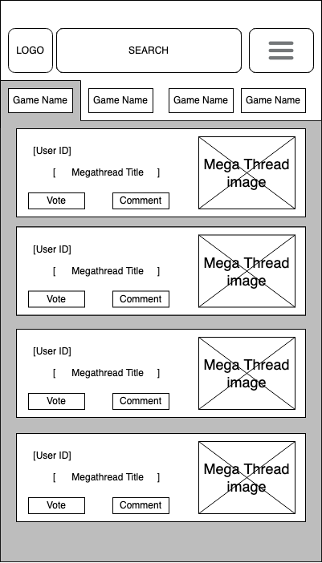

# User Experience Design

## App Map

## Wireframes
### Homepage

Purpose of the Screen: 
* This is the first screen a user will find when they access the Ranked website.
We want to present the most popular posts or forums of any miscellaneous game first (where the entire screen is vertical scrollable) and also have a scrolling list (horizontal) of games right underneath the header to increase engagement from the user. If they can’t find what they are looking for while scrolling they can either click/tap on the game name/icon or tag or game name, or even search for a keyword in the keyword button in the top. 
* They can also access the Login, About Us, and Contact Us page from the hamburger menu.
* 

### Megathread Page

Purpose of the Screen:
* This is the page that will appear after the user has selected a game from the scrolling game header on the Homepage.
* This page highlights one specific game and showcases megathreads related to that game.
* The “Game Name” tiles will have the game title written in text (as opposed to their image representation on the Homepage, this is for legibility and space).

### Subthread Page

Purpose of the Screen:
* This is the screen after a user selects a specific megathread from the Megathread page.
* The user can favorite or reply to any subthreads on the page using the two buttons to the right of each post. 
* The first post in each subthread features the profile picture of the original commenter. This is for space reasons so that the screen isn’t too cluttered.

### Login Page

Purpose of the Screen:
* This is the Login screen that the user can access through the hamburger menu at any time.
* The user can also navigate back and forth from Login to Register through the two buttons at the top of the login box.

### Register Page

Purpose of the Screen:
* This is the Register screen that the user can access through the Login screen.
* The user can also navigate back and forth from Login to Register through the two buttons at the top of the login box.

### Account Page

Purpose of the Screen:
* This is the Account page where users can update their personal information, change their password, and delete their account. 
* The admin button next to the highlighted info button takes privileged users to the admin panel, non-admin users will get a modal that they cannot access this page. 

### Admin Panel

Purpose of the Screen:
* This is immediately what an administrator sees after they access their admin panel. 
* It gives an easy/non-technical way to edit, delete, and create users and megathreads, along with seeing important / general information about users and megathreads.

### Megathreads Page - Admin Panel

Purpose of this screen:
* Gives administrator visibility on what’s going on in a single megathread.
* Gives administrator ability to find specific posts based on which megathread.
* Gives administrator ability to edit, delete, and add moderators to a megathread.

### User Profile Page - Admin Panel

Purpose of the Screen:
* Gives administrator more visibility on individual users.
* Gives administrator ability to edit, delete, or add megathreads that the user is a moderator of.
* Gives administrator ability to edit, or delete any posts made by a user.

### About Us Page

Purpose of the Screen:
* An informal page detailing our team’s vision, values, and other stuff for those that are interested. 
* It is linked to the Terms & Conditions for more important information.

### Terms & Conditions

Purpose of the Screen:
* A page that presents legal information for browsing. At any given point it should present a single legal document from a list of them. 
* Users can use Button A to access a dropdown menu that changes the currently shown document or the table of contents which leads them to a specific section of the current document.

* 

### Contact Us Page

Purpose of the Screen:
* This is the Contact page that can be reached anytime from the hamburger menu.
* This links to one of our emails and to the FAQ page.

### FAQ Page

Purpose of the Screen:
* This screen can be reached through the Contact Us page.
* This page contains FAQ and instructions on different functionalities such as thread creation and account set up. 

### Request a Thread Page

Purpose of the Screen: 
* When users find the megathread for the game that they are interested in has not been created yet, they can submit their request to the Ranked administrators by filling out the request form on the Request a Thread page.
* If the user selects “Yes” to the first question, this user will have the opportunity to gain administrator access to the new game thread that will be created.
* If the user also selects “Yes” to the second question and includes the username of their friends in the reasoning box down below, they will all have the opportunity to gain administrator access to the new game thread that will be created.